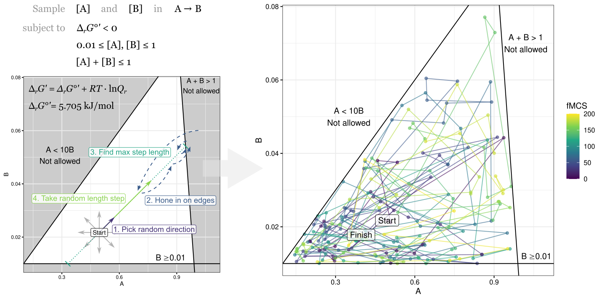
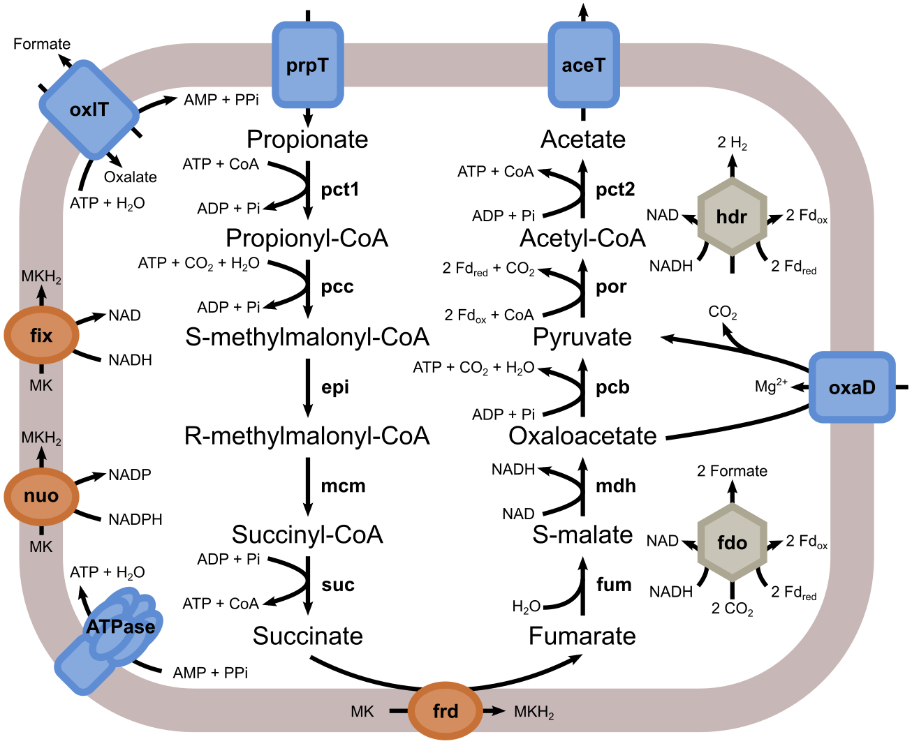

# Thermosampler

Linear programming and Markov Chain Monte Carlo sampling tools for thermodynamic analysis of metabolism.

### Contents

**1. [Background](#background)**

**2. [System requirements](#requirements)**

**3. [MDF and NEM analysis](#mdf)**

**4. [Hit-and-run analysis](#hit)**

**5. [Case study: Syntrophic communities](#syntrophism)**

**6. [Author](#author)**

<a name="background"></a>
## Background

### Motivation

Tools such as NET analysis ([Kümmel _et al._ 2006](https://doi.org/10.1038/msb4100074), [Zamboni _et al._ 2008](https://doi.org/10.1186/1471-2105-9-199)) allow calculation of the minimum and maximum feasible metabolite concentrations in a metabolic network, while ensuring that all reactions have a negative Gibbs free energy change, or, equivalently, a positive thermodynamic driving force. Similarly, Max-min Driving Force analysis (MDF; [Noor _et al._, 2014](http://doi.org/10.1371/journal.pcbi.1003483)) is another linear programming approach to finding an optimal set of metabolite concentrations in a metabolic network. However, the aforementioned approaches only identify extreme concentration values, which is why this `thermosampler` framework was developed to explore the full "solution space" of feasible metabolite concentrations (**[Fig 1](#fig1)**). A random walk, or hit-and-run algorithm, allows assessment of metabolite concentration distributions through exploration of all combinations of concentrations that are thermodynamically feasible.

<a name="fig1"></a>

|  |
| --- |
| **Fig 1. Thermosampler framework overview and example.** One feasible combination of concentrations within the solution space serves as starting point ("Start") for a random walk. First, a random direction is picked (1). Stepping outside and back into feasible space over and over (2) determines the longest possible step size in the positive and negative directions (3). Then a random step length is performed (4). A new point in the solution space is thus reached and the process is repeated many times over. The right panel depicts 200 steps performed by the `sampling.py` script. Color indicates step number (fMCS; feasible metabolite concentration set). Note that the random walk occurs in logarithmic space, which makes it appear as if higher concentrations are more sparsely sampled. |

### Toy model

As an example, a clearly defined solution space was devised using a "toy" model. The toy model has two metabolites, A and B, and one reaction where A is transformed into B. The standard Gibbs free energy change was selected to be 5.705 kJ/mol, which corresponds to the constraint that [A] must be at least 10 times higher than [B]. Furthermore, [A] and [B] must be within the concentration range 0.01 to 1, and the sum of [A] and [B] must be 1 or lower. These three constraints define a solution space on the AB-plane that has the shape of a triangle (**[Fig 1](#fig1)**). A real metabolic network has dozens of reactions and metabolites, and is therefore many magnitudes more complex and difficult to visualize.

### Example sampling

A random walk applying the `thermosampler` algorithm was performed within the triangular AB solution space using the `sampling.py` script:
```
./sampling.py --reactions examples/toy.model.tab \
--std_drG examples/toy.model_drgs.tab \
--constraints examples/toy.concentrations.tab \
--max_conc 1 --steps 200 \
--outfile results/toy.sampling.tab
```

The results from the random walk were then plotted to yield the right panel in **[Fig 1](#fig1)**:
```
examples/plot_toy_example.R
results/toy.sampling.pdf # Output PDF
```

<a name="feasibility"></a>
### Feasibility checks

In the `thermosampler` algorithm, the _feasibility_ concept and how to check it is very important, as it ensures that the random walk occurs within the solution space, and thereby defines the solution space itself. _Feasibility_ consists of adherence of the metabolite concentration vector to several constraints:
1. **Thermodynamic driving forces** of all reactions must be positive, based on the user-supplied model reactions and directions, as well as the user-supplied standard reaction Gibbs free energy changes.
2. **Metabolite concentration ratios** must be within the user-supplied ranges.
3. **Total metabolite concentration** sum must be below the user-defined value.
4. **Metabolite concentrations** must be within the user-supplied ranges.
5. **Sums of groups of metabolite concentrations** must be below the user-supplied values.

Several functions exist within `sampling.py` to perform the feasibility checks, and are called by the "master" feasibility function named `is_feasible`. It should be relatively simple to add additional feasibility checks to constrain the solution space further.

### Algorithm

The `thermosampler` algorithm starts at a feasible combination of concentrations within the solution space, _i.e._ one "feasible metabolite concentration set" (fMCS). This set is obtained through inefficient rejection sampling or from MDF analysis. More fMCSs are obtained along the random walk.

The `thermosampler` algorithm works as follows, with concentrations in logarithmic space:

1. **Create a step direction vector** of the same length as the concentrations vector, but with random values.
2. **Hone in on the edge of the solution space** by determining the maximum and minimum allowable factor _theta_ to apply to the step direction vector before adding it to the current concentrations vector. First the maximum step size without violating any of the initial concentration range bounds is added and [_feasibility_](#feasibility) is checked. If feasible, the edge has been found. If not, it is necessary to hone in on the edge of solution space by iteratively increasing the inner step size (starts at zero) and decreasing the outer step size (starts at the previously mentioned maximum), until the difference is smaller than a user-defined, small value.
3. Once the difference between inner and outer step size is small enough, the inner step size is taken as "touching" the edge of the solution space, and thereby constituting the maximum feasible step size. The minimum feasible step size (can be negative) is gained from performing step 2 in the opposite direction. Thereby **the minimum and maximum step size is determined**.
4. **Perform one step in the random walk** by sampling one step size factor _theta_ from the previously calculated range, multiplying the step direction vector by that factor, and adding the product to the current metabolite concentrations vector. The feasibility of the new vector, _i.e._ the new metabolite concentration set, is checked. The algorithm stops and prints an error if an infeasible point is reached, which could happen for example if the solution space would be noncontinuous or concave. The error is however more likely to occur from infeasible model parameters (the input files and variables).
5. **Repeat from step 1** until the desired number of steps through the solution space have been performed.

Practical examples of using the `thermosampler` algorithm with `sampling.py` are [shown below](#hit).

<a name="requirements"></a>
## System requirements

- Linux operating system (Tested on Ubuntu 18.04.5 LTS and 20.04.2 LTS)
- bash 4.0 (Tested with 4.4.20 and 5.0.17)
- Python ≥ 3.7 (Tested with 3.7.6)
- R ≥ 4.1.1 (Tested with 4.1.1)
- GNU parallel 20161222 (Tested with 20161222)
- Python libraries: numpy, pandas, scipy
- R libraries: doMC, foreach, ggridges, optparse, scales, tidyverse

<a name="mdf"></a>
## MDF and NEM analysis

`mdf.py` performs Max-min Driving Force (MDF; [Noor _et al._, 2014](http://doi.org/10.1371/journal.pcbi.1003483)) and Network-Embedded
MDF (NEM; [Asplund-Samuelsson _et al._, 2018](https://doi.org/10.1016/j.ymben.2017.12.011)) analysis. Run `./mdf.py -h` to list all options of the script.

#### Example: NEM analysis on lysine biosynthesis in _E. coli_ and _Synechocystis_

```
./mdf.py --min_conc 0.0000001 --max_conc 0.1 \
--constraints examples/E_coli.concentrations.tab \
--ratios examples/E_coli.Lys_opt_ratios.tab \
--pathway examples/E_coli.Lys_pathway.txt \
examples/E_coli.model.tab \
examples/E_coli.model_drgs.tab \
results/E_coli_Lys_nem.csv
```

```
./mdf.py --min_conc 0.0000001 --max_conc 0.1 \
--constraints examples/Synechocystis.concentrations.tab \
--ratios examples/Synechocystis.Lys_opt_ratios.tab \
--pathway examples/Synechocystis.Lys_pathway.txt \
examples/Synechocystis.model.tab \
examples/Synechocystis.model_drgs.tab \
results/Synechocystis_Lys_nem.csv
```

#### Example: MDF analysis on TCA cycle

```
./mdf.py --min_conc 0.0000001 --max_conc 0.1 \
--constraints examples/tca.concentrations.tab \
--ratios examples/tca.ratios.tab examples/tca.model.tab \
examples/tca.model_drgs.tab results/tca_mdf.csv
```

<a name="hit"></a>
## Hit-and-run analysis

`sampling.py` performs hit-and-run sampling of feasible metabolite concentration sets by a random walk through the solution space. Run `./sampling.py -h` to list all options of the script.

#### Quick example: Hit-and-run sampling on TCA cycle starting from and maintaining MDF

```
./sampling.py --reactions examples/tca.model.tab \
--std_drG examples/tca.model_drgs.tab \
--outfile results/tca.mdf_sampling.tab \
--constraints examples/tca.concentrations.tab \
--concs results/tca_mdf.csv --steps 1000 --mdf 1.3
```

#### Advanced example: Hit-and-run sampling on TCA cycle with replicates

Here we sample TCA cycle metabolite concentrations five times, computed in parallel and always starting from the MDF, saving every 10th step. In the first sampling all reactions must have a driving force > 0 kJ/mol, while in the second sampling all reactions must have a driving force > 1.18 kJ/mol, which is 90% of the MDF.

```
# Sample 5 replicates of 10000 steps in parallel at feasible delta G
for i in {1..5}; do
  echo "./sampling.py --reactions examples/tca.model.tab \
  --std_drG examples/tca.model_drgs.tab \
  --ratios examples/tca.ratio_range.tab \
  --outfile results/tca_sampling/tca.Feasible.${i}.tab \
  --constraints examples/tca.concentrations.tab \
  --concs results/tca_mdf.csv --steps 10000 --max_conc 1.2 -n 10"
done | parallel --no-notice --jobs 5

# Sample 5 replicates of 10000 steps in parallel at optimum delta G (90% of MDF)
for i in {1..5}; do
  echo "./sampling.py --reactions examples/tca.model.tab \
  --std_drG examples/tca.model_drgs.tab \
  --ratios examples/tca.ratio_range.tab \
  --outfile results/tca_sampling/tca.Optimal.${i}.tab \
  --constraints examples/tca.concentrations.tab \
  --concs results/tca_mdf.csv --steps 10000 --max_conc 1.2 \
  --mdf 1.18 -n 10"
done | parallel --no-notice --jobs 5
```

##### Convert reaction table to stoichiometric matrix

`stoich.py` converts a model in reaction table format to a model in stoichiometric matrix format. Run `./stoich.py -h` to list all options of the script. This representation of the model is needed for plotting in the next step.

```
./stoich.py examples/tca.model.tab results/tca.stoich.tab
```

##### Plot the output of multiple hit-and-run sampling replicates

`plot_samples.R` creates principal component analysis (PCA), concentration, and driving force plots from hit-and-run sampling experiments. Run `./plot_samples.R -h` to list all options of the script. All sampling results files used as input must be stored without any other files in one directory (`--indir` option). Sampling results files must have the `<path>/<indir>/<experiment>.<group>.<replicate>.tab` name format (even if there is only one group and/or only one replicate).

```
./plot_samples.R -i results/tca_sampling -S results/tca.stoich.tab \
-G examples/tca.model_drgs.tab -c examples/tca.concentrations.tab \
-x C00001 -o results/tca_sampling_plots
```

Plotting yields the following output files:
```
results/tca_sampling_plots.sampling_pca.png
results/tca_sampling_plots.sampling_pca_combo.png
results/tca_sampling_plots.sampling_concs.pdf
results/tca_sampling_plots.sampling_concs_combo.pdf
results/tca_sampling_plots.sampling_dfs.pdf
results/tca_sampling_plots.sampling_dfs_combo.pdf
```

The `combo` tag indicates that replicates have been combined in the plot and are not displayed individually, as in the other variant of each plot type. Combining multiple  replicates improves coverage of the solution space.

The PCA divided by individual samples (`results/tca_sampling_plots.sampling_pca.png`) shows how each random walk in the hit-and-run algorithm has traversed the solution space. The point color indicates the index of each feasible metabolite concentration set (fMCS) produced by the random walk. The figure below shows a cutout with a single replicate, where the left panel is the random walk at a driving force > 0 kJ/mol ("Feasible"), and the right panel has a driving force > 1.18 kJ/mol ("Optimal"). Note that the actual output file contains all replicates and is provided in the `results` directory.


The combined PCA plot (`results/tca_sampling_plots.sampling_pca_combo.png`) layers all replicate random walks, giving an indication of the coverage of the solution space. Each replicate up to 12 in total is given a unique color. The transparency attempts to show the step index.


Concentration distributions obtained from the random walk are first visualized divided by replicate (`results/tca_sampling_plots.sampling_concs.pdf`). "Feasible" is a driving force > 0 kJ/mol and "Optimal" is a driving force > 1.18 kJ/mol. Note that "Feasible" and "Optimal" are the `Group` variable names we gave to the two experiments through their file names. Up to 9 such names/groups can be selected freely to accomodate different types of experiments. In the concentration plots below, the vertical line marks on the x axes indicate the boundaries of the input concentration ranges.


As the random walks are quite noisy, it is best to combine multiple replicates to obtain smoother distributions. It can also be helpful to perform more steps, for example in the millions. The combined plot visualizes all values from all replicates of each group (`results/tca_sampling_plots.sampling_concs_combo.pdf`). Distributions are compared between `Group` variables with the Kolmogorov-Smirnov algorithm (function `ks.test`), providing the _D_ statistic that measures how different two distributions are. The _D_ statistic is indicated by the color ("Difference") of vertical lines connecting two distributions, situated in each facet to the right of the distributions. Any two distributions with _D_ ≤ 0.15 are considered equal and therefore do not get a connecting vertical line.


Finally, the plotting script calculates the driving forces for each reaction based on the sampled metabolite concentrations. The driving forces are first plotted per replicate (`results/tca_sampling_plots.sampling_dfs.pdf`). Note that the x axis uses a square root scale.


Then, driving forces are plotted with replicates combined to yield a smoother representation of the thermodynamic solution space (`results/tca_sampling_plots.sampling_dfs_combo.pdf`). It appears that [R01082](https://www.genome.jp/dbget-bin/www_bget?rn:R01082), i.e. fumarate hydratase, is somewhat of a thermodynamic bottleneck in this experiment. As for the concentrations, the Kolmogorov-Smirnov _D_ statistic ("Difference") is used to highlight differences in the distribution shapes.


<a name="syntrophism"></a>
## Case study: Syntrophic communities

One application of _thermosampler_ is the study of the metabolite concentrations and thermodynamics of metabolic reactions in microbial communities. Syntrophic propionate oxidation and methanogenesis was considered in this case study.

### Syntrophic propionate oxidizer model

A model was prepared for a syntrophic propionate oxidizing bacterium (SPOB) based on [_Candidatus_ Syntrophopropionicum ammoniitolerans](https://doi.org/10.1111/1462-2920.15388) (**[Fig 2](#fig2)**). The model was parameterized using data from literature and Equilibrator.

| Model component | File |
| --- | --- |
| Reactions describing metabolic network | `data/methylmalonyl.model.tab` |
| Stoichiometric matrix from `stoich.py` | `data/methylmalonyl.stoich.tab` |
| Standard reaction Gibbs free energy changes | `data/methylmalonyl.model_drGs.tab` |
| Default metabolite concentration ranges | `data/methylmalonyl.concentrations.tab` |
| Fixed concentration ratios for MDF | `data/methylmalonyl.ratios.tab` |
| Concentration ratio ranges for sampling | `data/methylmalonyl.ratio_range.tab` |

<a name="fig2"></a>

|  |
| --- |
| **Fig 2. Model of syntrophic propionate oxidizing bacterium.** Protons (H<sup>+</sup>) are not shown. Fd<sub>red</sub>, reduced ferredoxin; Fd<sub>ox</sub>, oxidized ferredoxin; MK, menaquinone. |

Fixed extracellular high and low propionate (input metabolite) and acetate (output metabolite) concentrations were defined to allow _thermosampler_ analysis regarding the thermodynamic effects of such conditions.

| Concentrations | File |
| --- | --- |
| Default | `data/mmcoa_fixed_prp_ac/methylmalonyl.concentrations.free.tab` |
| High acetate | `data/mmcoa_fixed_prp_ac/methylmalonyl.concentrations.acHi.tab` |
| Low propionate | `data/mmcoa_fixed_prp_ac/methylmalonyl.concentrations.prpLo.tab` |
| High prp/Low ac | `data/mmcoa_fixed_prp_ac/methylmalonyl.concentrations.prpHi_acLo.tab` |
| Low prp/High ac | `data/mmcoa_fixed_prp_ac/methylmalonyl.concentrations.prpLo_acHi.tab` |

The SPOB model was used to sample thermodynamically feasible metabolite concentrations for all the conditions above as described in this Bash script:

```
source/methylmalonyl_fixed_prp_ac.sh
```

The results were plotted using `plot_samples.R` and yielded the following output:

<details>
<summary>Full dataset plots.</summary>

```
# Random walk PCA
results/mmcoa_fixed_prp_ac_plots.sampling_pca_combo.png
results/mmcoa_fixed_prp_ac_plots.sampling_pca.png

# Concentrations and driving forces PCA
results/mmcoa_fixed_prp_ac_plots.concs.pca.pdf
results/mmcoa_fixed_prp_ac_plots.dfs.pca.pdf

# Concentration distributions
results/mmcoa_fixed_prp_ac_plots.sampling_concs_combo.pdf
results/mmcoa_fixed_prp_ac_plots.sampling_concs.pdf

# Driving force distributions
results/mmcoa_fixed_prp_ac_plots.sampling_dfs_combo.pdf
results/mmcoa_fixed_prp_ac_plots.sampling_dfs.pdf
```
</details>

<details>
<summary>Reduced dataset plots.</summary>

```
# Random walk PCA
results/mmcoa_fixed_prp_ac_plots_reduced.sampling_pca_combo.png
results/mmcoa_fixed_prp_ac_plots_reduced.sampling_pca.png

# Concentrations and driving forces PCA
results/mmcoa_fixed_prp_ac_plots_reduced.concs.pca.pdf
results/mmcoa_fixed_prp_ac_plots_reduced.dfs.pca.pdf

# Concentration distributions
results/mmcoa_fixed_prp_ac_plots_reduced.sampling_concs_combo.pdf
results/mmcoa_fixed_prp_ac_plots_reduced.sampling_concs.pdf

# Driving force distributions
results/mmcoa_fixed_prp_ac_plots_reduced.sampling_dfs_combo.pdf
results/mmcoa_fixed_prp_ac_plots_reduced.sampling_dfs.pdf
```
</details>

<a name="author"></a>
## Author
Johannes Asplund-Samuelsson, KTH (johannes.asplund.samuelsson@scilifelab.se)
