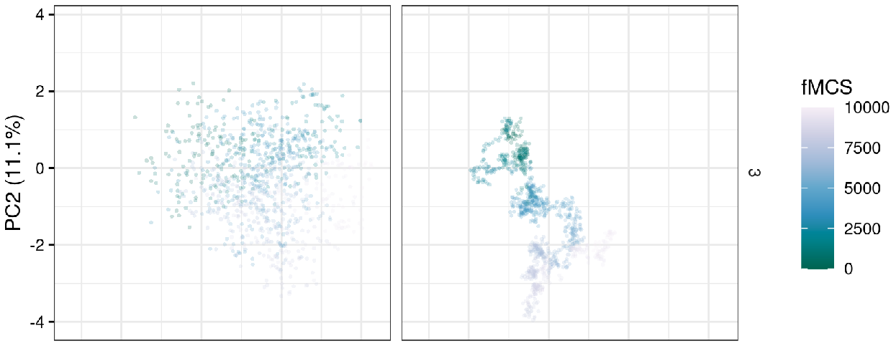
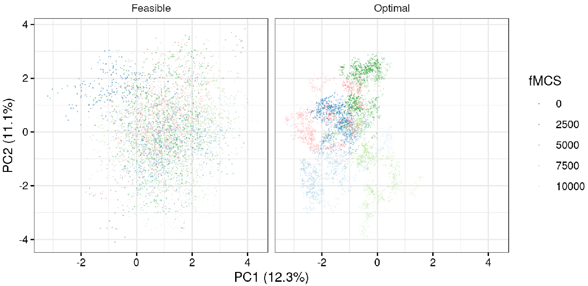
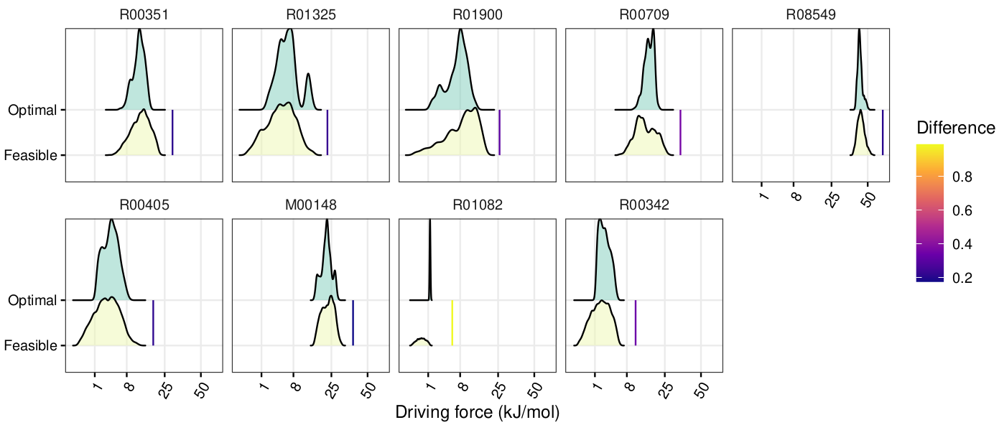

# Thermosampler

Linear programming and Markov Chain Monte Carlo sampling tools for thermodynamic analysis of metabolism.

### MDF and NEM analysis

`mdf.py` performs Max-min Driving Force (MDF; [Noor _et al._, 2014](http://doi.org/10.1371/journal.pcbi.1003483)) and Network-Embedded
MDF (NEM; [Asplund-Samuelsson _et al._, 2018](https://doi.org/10.1016/j.ymben.2017.12.011)) analysis. Run `./mdf.py -h` to list all options of the script.

#### Example: NEM analysis on lysine biosynthesis in _E. coli_ and _Synechocystis_

```
./mdf.py --min_conc 0.0000001 --max_conc 0.1 \
--constraints examples/E_coli.concentrations.tab \
--ratios examples/E_coli.Lys_opt_ratios.tab \
--pathway examples/E_coli.Lys_pathway.txt \
examples/E_coli.model.tab \
examples/E_coli.model_drgs.tab \
results/E_coli_Lys_nem.csv
```

```
./mdf.py --min_conc 0.0000001 --max_conc 0.1 \
--constraints examples/Synechocystis.concentrations.tab \
--ratios examples/Synechocystis.Lys_opt_ratios.tab \
--pathway examples/Synechocystis.Lys_pathway.txt \
examples/Synechocystis.model.tab \
examples/Synechocystis.model_drgs.tab \
results/Synechocystis_Lys_nem.csv
```

#### Example: MDF analysis on TCA cycle

```
./mdf.py --min_conc 0.0000001 --max_conc 0.1 \
--constraints examples/tca.concentrations.tab \
--ratios examples/tca.ratios.tab examples/tca.model.tab \
examples/tca.model_drgs.tab results/tca_mdf.csv
```

### Hit-and-run analysis

`sampling.py` performs hit-and-run sampling of feasible metabolite concentration sets by a random walk through the solution space. Run `./sampling.py -h` to list all options of the script.

#### Quick example: Hit-and-run sampling on TCA cycle starting from and maintaining MDF

```
./sampling.py --reactions examples/tca.model.tab \
--std_drG examples/tca.model_drgs.tab \
--outfile results/tca.mdf_sampling.tab \
--constraints examples/tca.concentrations.tab \
--concs results/tca_mdf.csv --steps 1000 --mdf 1.3
```

#### Advanced example: Hit-and-run sampling on TCA cycle with replicates

Here we sample TCA cycle metabolite concentrations five times, computed in parallel and always starting from the MDF, saving every 10th step. In the first sampling all reactions must have a driving force > 0 kJ/mol, while in the second sampling all reactions must have a driving force > 1.18 kJ/mol, which is 90% of the MDF.

```
# Sample 5 replicates of 10000 steps in parallel at feasible delta G
for i in {1..5}; do
  echo "./sampling.py --reactions examples/tca.model.tab \
  --std_drG examples/tca.model_drgs.tab \
  --ratios examples/tca.ratio_range.tab \
  --outfile results/tca_sampling/tca.Feasible.${i}.tab \
  --constraints examples/tca.concentrations.tab \
  --concs results/tca_mdf.csv --steps 10000 --max_conc 1.2 -n 10"
done | parallel --no-notice --jobs 5

# Sample 5 replicates of 10000 steps in parallel at optimum delta G (90% of MDF)
for i in {1..5}; do
  echo "./sampling.py --reactions examples/tca.model.tab \
  --std_drG examples/tca.model_drgs.tab \
  --ratios examples/tca.ratio_range.tab \
  --outfile results/tca_sampling/tca.Optimal.${i}.tab \
  --constraints examples/tca.concentrations.tab \
  --concs results/tca_mdf.csv --steps 10000 --max_conc 1.2 \
  --mdf 1.18 -n 10"
done | parallel --no-notice --jobs 5
```

##### Convert reaction table to stoichiometric matrix

`stoich.py` converts a model in reaction table format to a model in stoichiometric matrix format. Run `./stoich.py -h` to list all options of the script. This representation of the model is needed for plotting in the next step.

```
./stoich.py examples/tca.model.tab results/tca.stoich.tab
```

##### Plot the output of multiple hit-and-run sampling replicates

`plot_samples.R` creates principal component analysis (PCA), concentration, and driving force plots from hit-and-run sampling experiments. Run `./plot_samples.R -h` to list all options of the script. All sampling results files used as input must be stored without any other files in one directory (`--indir` option). Sampling results files must have the `<path>/<indir>/<experiment>.<group>.<replicate>.tab` name format (even if there is only one group and/or only one replicate).

```
./plot_samples.R -i results/tca_sampling -S results/tca.stoich.tab \
-G examples/tca.model_drgs.tab -c examples/tca.concentrations.tab \
-x C00001 -o results/tca_sampling_plots
```

Plotting yields the following output files:
```
results/tca_sampling_plots.sampling_pca.png
results/tca_sampling_plots.sampling_pca_combo.png
results/tca_sampling_plots.sampling_concs.pdf
results/tca_sampling_plots.sampling_concs_combo.pdf
results/tca_sampling_plots.sampling_dfs.pdf
results/tca_sampling_plots.sampling_dfs_combo.pdf
```

The `combo` tag indicates that replicates have been combined in the plot and are not displayed individually, as in the other variant of each plot type. Combining multiple  replicates improves coverage of the solution space.

The PCA divided by individual samples (`results/tca_sampling_plots.sampling_pca.png`) shows how each random walk in the hit-and-run algorithm has traversed the solution space. The point color indicates the index of each feasible metabolite concentration set (fMCS) produced by the random walk. The figure below shows a cutout with a single replicate, where the left panel is the random walk at a driving force > 0 kJ/mol ("Feasible"), and the right panel has a driving force > 1.18 kJ/mol ("Optimal"). Note that the actual output file contains all replicates and is provided in the `results` directory.



The combined PCA plot (`results/tca_sampling_plots.sampling_pca_combo.png`) layers all replicate random walks, giving an indication of the coverage of the solution space. Each replicate up to 12 in total is given a unique color. The transparency attempts to show the step index.



Concentration distributions obtained from the random walk are first visualized divided by replicate (`results/tca_sampling_plots.sampling_concs.pdf`). "Feasible" is a driving force > 0 kJ/mol and "Optimal" is a driving force > 1.18 kJ/mol. Note that "Feasible" and "Optimal" are the `Group` variable names we gave to the two experiments through their file names. Up to 9 such names/groups can be selected freely to accomodate different types of experiments. In the concentration plots below, the vertical line marks on the x axes indicate the boundaries of the input concentration ranges.


As the random walks are quite noisy, it is best to combine multiple replicates to obtain smoother distributions. It can also be helpful to perform more steps, for example in the millions. The combined plot visualizes all values from all replicates of each group (`results/tca_sampling_plots.sampling_concs_combo.pdf`).


Finally, the plotting script calculates the driving forces for each reaction based on the sampled metabolite concentrations. The driving forces are first plotted per replicate (`results/tca_sampling_plots.sampling_dfs.pdf`). Note that the x axis uses a square root scale.


Then, driving forces are plotted with replicates combined to yield a smoother representation of the thermodynamic solution space (`results/tca_sampling_plots.sampling_dfs_combo.pdf`). It appears that [R01082](https://www.genome.jp/dbget-bin/www_bget?rn:R01082), i.e. fumarate hydratase, is somewhat of a thermodynamic bottleneck in this experiment.



### Author
Johannes Asplund-Samuelsson, KTH (johannes.asplund.samuelsson@scilifelab.se)
